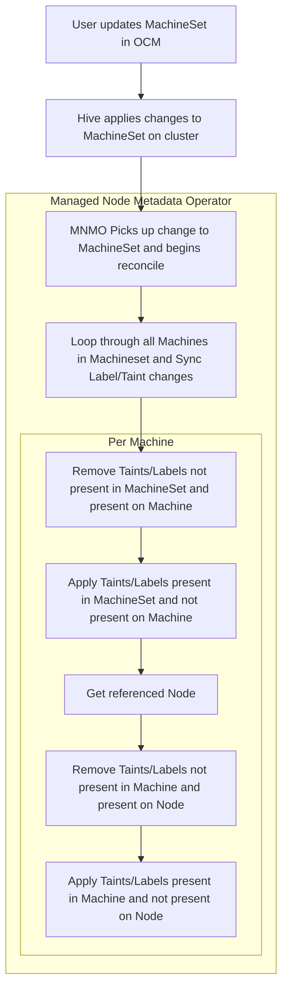

# Node Metadata Operator for OpenShift Dedicated

Directional metadata sync operator from MachineSets to existing Nodes

## General Overview

Adding node labels and taints to non-default MachinePools is allowed through OCM; however, due to [intentional limitations](https://github.com/openshift/machine-api-operator/blob/master/FAQ.md#adding-annotations-and-labels-to-nodes-via-machines) in OpenShift’s [machine-api-operator](https://github.com/openshift/machine-api-operator), labels and taints are not reconciled to existing machines within a machine set. Today you must scale down the MachinePool to 0 and back up again to update nodes. This is obviously undesirable and doesn’t present a good user experience for customers.

Managed OpenShift does not allow customers to label nodes directly. 

This managed-node-metadata-operator will attempt to watch MachineSet objects and reconcile any labels or taints that are added to the corresponding Nodes within the pool.

## Development and Testing
Please refer to the [development and testing guide](docs/development-and-testing.md).

## Boilerplate
This repository subscribes to the [openshift/golang-osd-operator](https://github.com/openshift/boilerplate/tree/master/boilerplate/openshift/golang-osd-operator) convention of [boilerplate](https://github.com/openshift/boilerplate/).
See the [README](boilerplate/openshift/golang-osd-operator/README.md) for details about the functionality that brings in.

