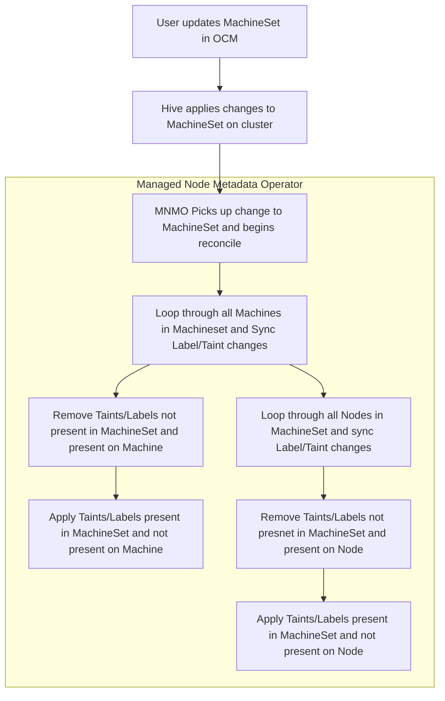

# managed-node-metadata-operator
Directional metadata sync operator from MachineSets to existing Nodes

## Purpose
Adding node labels and taints to non default MachinePools is allowed through OCM however due to [intentional limitations](https://github.com/openshift/machine-api-operator/blob/master/FAQ.md#adding-annotations-and-labels-to-nodes-via-machines) in OpenShift’s [machine-api-operator](https://github.com/openshift/machine-api-operator), labels and taints are not reconciled to existing machines within a machine set. Today you must scale down the MachinePool to 0 and back up again to update nodes. This is obviously undesirable and doesn’t present a good user experience for customers.

Managed OpenShift does not allow customers to label nodes directly. 

This managed-node-metadata-operator will attempt to watch MachineSet objects and reconcile any labels or taints that are added to the corresponding Nodes within the pool.

