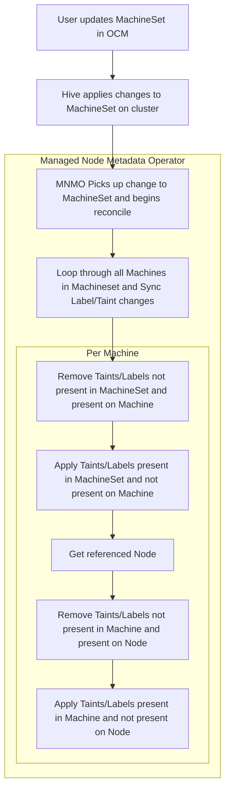

# Node Metadata Operator for OpenShift Dedicated

Directional metadata sync operator from MachineSets to existing Nodes

## Purpose

Adding node labels and taints to non-default MachinePools is allowed through OCM; however, due to [intentional limitations](https://github.com/openshift/machine-api-operator/blob/master/FAQ.md#adding-annotations-and-labels-to-nodes-via-machines) in OpenShift’s [machine-api-operator](https://github.com/openshift/machine-api-operator), labels and taints are not reconciled to existing machines within a machine set. Today you must scale down the MachinePool to 0 and back up again to update nodes. This is obviously undesirable and doesn’t present a good user experience for customers.

Managed OpenShift does not allow customers to label nodes directly. 

This managed-node-metadata-operator will attempt to watch MachineSet objects and reconcile any labels or taints that are added to the corresponding Nodes within the pool.



## Development

### Running pipeline scripts locally

The script that's run in the pipeline is located in [./hack/app_sre_build_deploy.sh].
Make sure to have the following environment variables set when running it:

```
REGISTRY_TOKEN=... # Get from quay.io user settings "Generate encrypted password"
REGISTRY_USER=... # quay.io username
IMG=quay.io/$REGISTRY_USER/managed-node-metadata-operator
IMAGE_REPOSITORY=$REGISTRY_USER
CONTAINER_ENGINE=docker # Currently this script requires docker as container engine
QUAY_IMAGE=$IMG
QUAY_USER=$REGISTRY_TOKEN
QUAY_TOKEN=$REGISTRY_TOKEN
QUAY_USER=$REGISTRY_USER
```

Additionally setting `DRY_RUN=y` will skip the push to the OLM repository and image registry.
Set `DRY_RUN=nopush` if you only want to skip the push to the OLM repository.

Before running the script, ensure the repositories quay.io/$REGISTRY_USER/managed-node-metadata-operator and quay.io/$REGISTRY_USER/managed-node-metadata-operator-registry exist.

### Running integration tests

Integration tests use the same client library as the operator itself.
You can run them against an OpenShift cluster by running the go tests in the `int` folder:

```
go run -count=1 ./int/...
```

Make sure to exclude them when running unit tests.
They are excluded when running `make test` by default.
